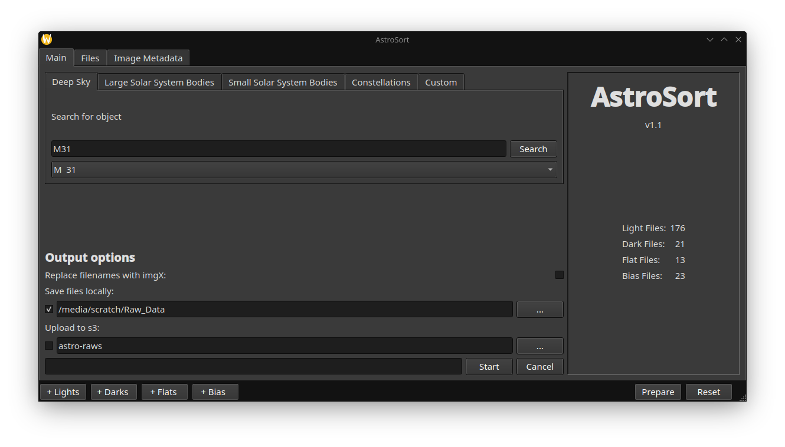
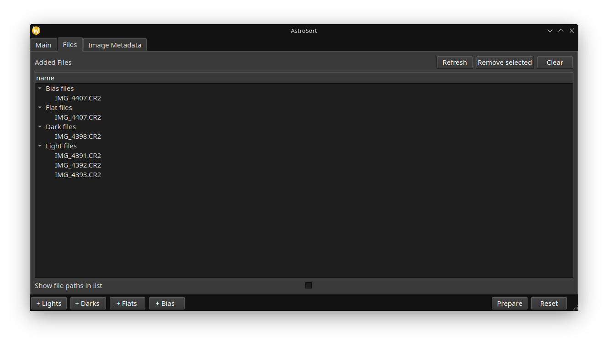
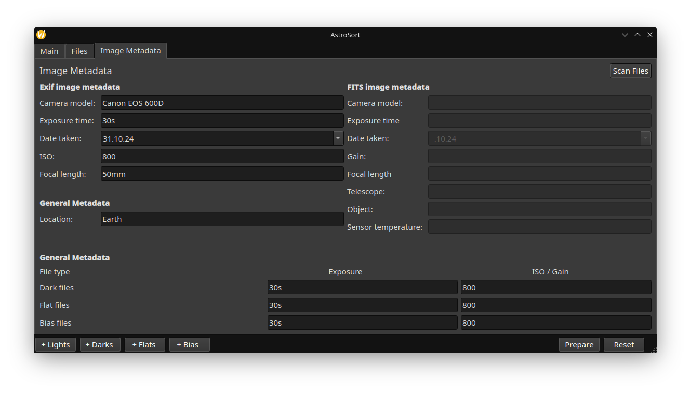

<h1 align="center">AstroSort</h1>

<h3 align="center">AstroSort is a tool to help organize raw astrophotography images. </h3>
<br/>

<p align="center">



</p>

### Features
- Copy and rename added images into a easily recognizable structure
- Handles light, dark, flat and bias frames
- Inserts additional information into the folder structure and file names such as:
  object, date, camera, focal length, exposure time and iso/gain value
- Files can be stored locally or uploaded to s3
- Most of the metadata can be pulled from the image files if exiftool is available on PATH
- Object search following categories: Deep Sky, large and small solar system objects, constellations and a custom category
- Search prioritizes Messier, IC, and NGC catalogues for naming
- Generated folder structure can be used directly in common stacking software
- Most default parameters and settings can be loaded from a settings file
- Custom profiles for image metadata available (3 Slots)
- No restriction for file type
- No changes to the raw files with exception of the name

### Example of new file structure:
```
ObjectCategory/
└── ObjectName
    └── Date_Location
        └── Camera_Focal-Length
            ├── BIAS
            │   └── B_Exposure_ISO/Gain_Image-Name
            ├── DARKS
            │   └── D_30s_800_IMG_4398.CR2
            ├── FLATS
            │   └── F_30s_800_IMG_4401.CR2
            └── LIGHTS
                └── L_30s_800_IMG_4393.CR2
```

### Built using:
- [PySide6](https://wiki.qt.io/Main)
- [Astroquery](https://github.com/astropy/astroquery)
