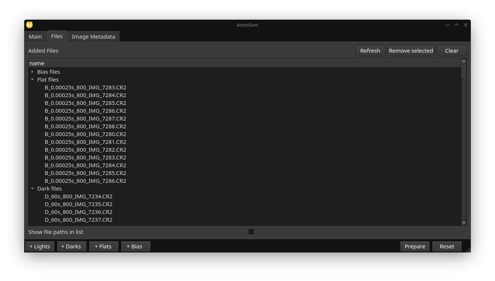
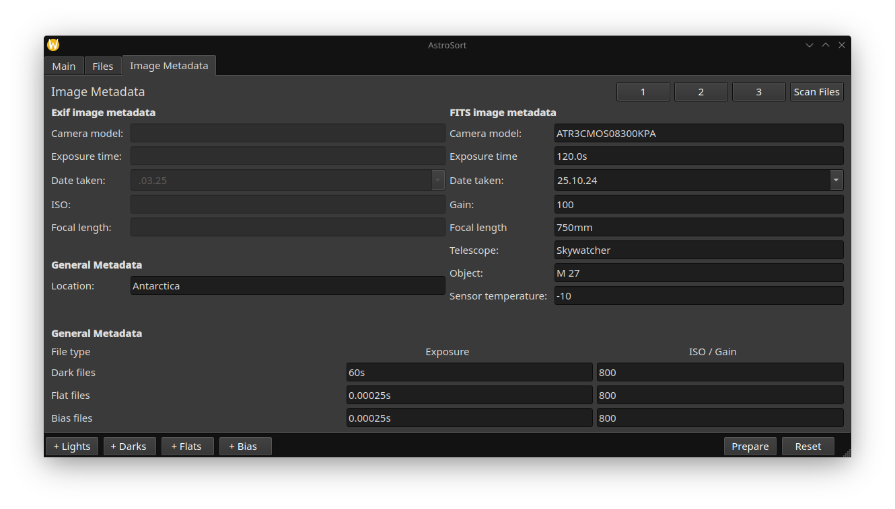

<h1 align="center">AstroSort</h1>

<h3 align="center">AstroSort is a tool to help organize raw astrophotography images. </h3>
<br/>

<p align="center">



</p>

- copy and rename added images into a easily recognizable structure
- handles light, dark, flat and bias frames
- inserts additional information into the folder structure and file names such as:
  object, date, camera, focal length, exposure time and iso/gain value
- object search following categories: Deep Sky, large and small solar system objects, constellations and a custom category
- generated folder structure can be used directly in common stacking software
- no restriction for file type
- no changes to the raw files with exception of the name

## The new file structure is as follows:
```
output_path/object-name/date_camera_focal-length/LIGHTS/L_camera_focal-length_image-name.ext
                                                /DARKS/D_camera_focal-length_image-name.ext
                                                /FLATS/F_camera_focal-length_image-name.ext
                                                /BIAS/b_camera_focal-length_image-name.ext
```
### Example:
```
── M31
   └── 2-9-2024_600D_135mm
       ├── BIAS
       │   ├── B_600D_135mm_IMG_0531.CR2
       │   ├── B_600D_135mm_IMG_0532.CR2
       │   ├── B_600D_135mm_IMG_0533.CR2
       │   └── B_600D_135mm_IMG_0534.CR2
       ├── DARKS
       │   ├── D_600D_135mm_IMG_0519.CR2
       │   └── D_600D_135mm_IMG_0520.CR2
       ├── FLATS
       │   ├── F_600D_135mm_IMG_0517.CR2
       │   └── F_600D_135mm_IMG_0518.CR2
       └── LIGHTS
           ├── L_600D_135mm_IMG_0515.CR2
           └── L_600D_135mm_IMG_0516.CR2
```

### Built using:
- [PySide6](https://wiki.qt.io/Main)
- [Astroquery](https://github.com/astropy/astroquery)
